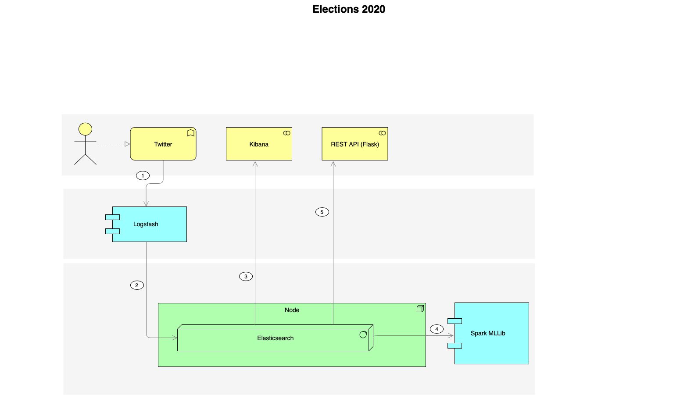

# Elections 2020 using data science

* Ingest twitter data into Elasticsearch using Logstash
* Create dashboard of trending candidates in a time period.
* Recommend accounts tweeting about same candidate.
* Predict voting pattern of Twitter user based on tweets.

## Description
1. Ingest 
2. Remove bots(if possible)
3. Train collaborative filtering model using Spark MLLib.
4. Save the resulting model into Elasticsearch.
5. ES Plugin of model. 
6. API to make query and get candidate for a Twitter account. 

## Stack
* [Elasticsearch]
* [Logstash]
* [Kibana]
* [Apache Spark](https://spark.apache.org/): An open-source, fast and general-purpose cluster computing system
* [Elasticsearch](https://www.elastic.co/): Open-source search and analytics engine
* [Jupyter Notebooks](https://jupyter.org/): An open-source web application that allows you to create and share documents that contain live code, equations, visualizations and explanatory text.

## References

